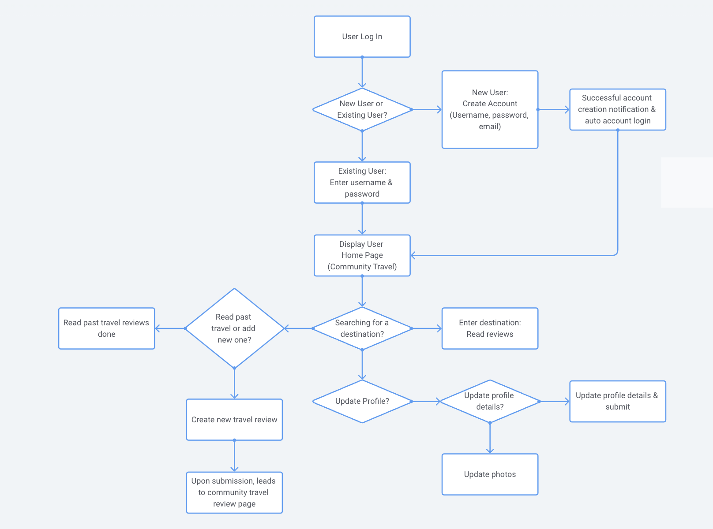
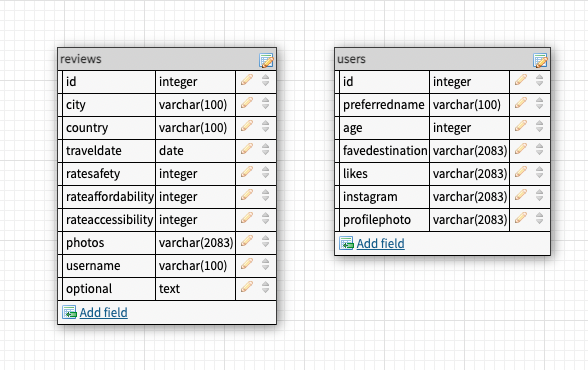
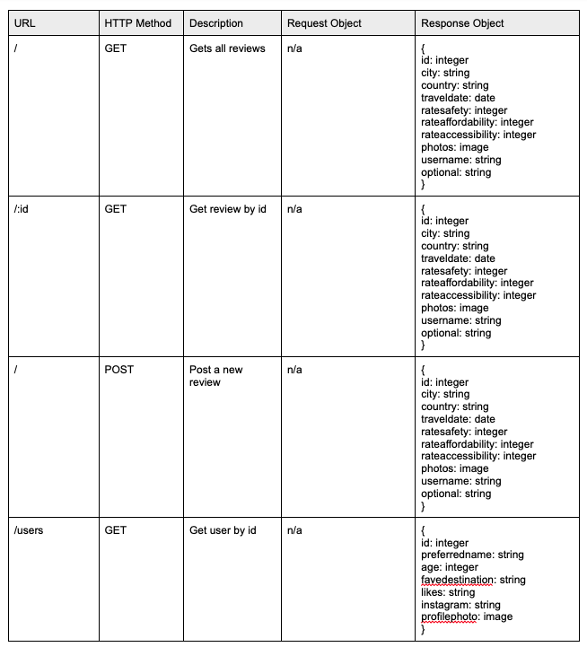

# World Wide Women App

Using the technologies of React, Node/Express, and MySQL, to add and display travel reviews to assist in the travel adventures of solo women travellers.




## Setup

### Dependencies

Run `npm run install` in the project folder to install dependencies related to Express (the server).

Run `npm install react-icons` in the project folder to install the react icon package which will provide the star icon used

`cd client` and run `npm run install` install dependencies related to React (the client).

### Database Prep

- Access the MySQL interface in your terminal by running `mysql -u root -p`
- Create a new database called reviews: `create database reviews`
- Add a `.env` file to the project folder of this repository containing the MySQL authentication information for MySQL user. For example:

```bash
  DB_HOST=localhost
  DB_NAME=reviews
  DB_USER=root
  DB_PASS=YOURPASSWORD
```

- Run `npm run migrate` in the project folder of this repository, in a new terminal window. This will create a table called 'students' in your database.

- In your MySQL console, you can run `use reviews;` and then `describe reviews;` to see the structure of the reviews table.




### Run Your Development Servers

- Run `npm start` in project directory to start the Express server on port 5000
- In another terminal, do `cd client` and run `npm start` to start the client in development mode with hot reloading in port 3000.
- You can test your client app in `http://localhost:3000`
- You can test your API in `http://localhost:5000/api`

## Notes

For the powerpoint presentation: `https://docs.google.com/presentation/d/1y_rAeFDhkDqVLgP6kRaHsAGazoeSCtTsTjWnncQQ7Zc/edit?usp=sharing`

Please find below a few additional notes:

1.) There are a couple of files not actually in use.
Under routes - specifically index.js and advisory.js (Travel Advisories are being pulled from the front end through an API)
Under public - alpha2.json (this was my attempt at potentially creating something that would allow me to convert the ISO Country Alpha-2 codes being used by the Travel Advisory API into actual country names when searching).

2.) Under src -> views, AddReviewView.js connects with the ReviewView.js to display all added reviews in the ReviewView page (which is essentially the homepage/first page you view)

3.) The UserProfileView.js (Login page) does not pull or display all users, so to view users individually, add the userID to the end of the link
Example: `http://localhost:3000/users/3`

4.) For TravelAdvisory.js (Travel Advisoriy page), the API searches based off ISO Country Alpha-2 codes `https://www.iban.com/country-codes`
No API key is necessary.

_This is a student project that was created at [CodeOp](http://CodeOp.tech), a full stack development bootcamp in Barcelona._
